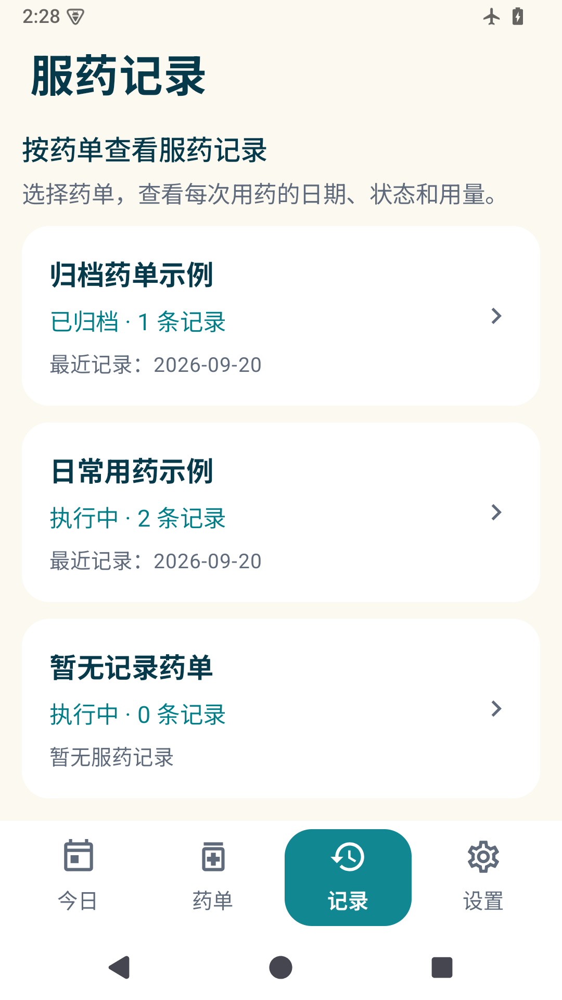
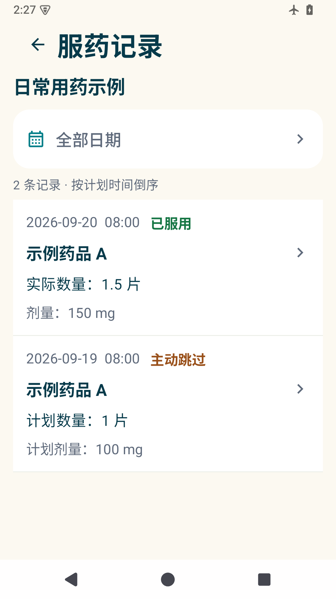
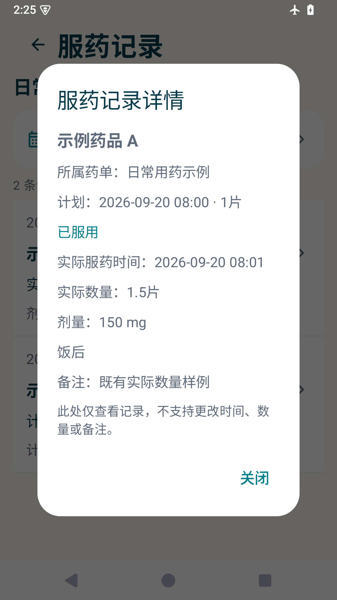

# 用药记

Android 本地用药事项、药单 OCR、提醒及服药记录。单人使用，一个事项可以包含多种药品，每个每日时刻可设置不同用量。

## 下载

[下载 v1.3.2 APK](https://github.com/lichengjie19/medication-reminder-android/releases/download/v1.3.2/medication-reminder-v1.3.2.apk) · [版本说明与校验文件](https://github.com/lichengjie19/medication-reminder-android/releases/tag/v1.3.2)

支持 Android 8.0 及以上。本安装包使用既有调试签名，可覆盖安装此前本地交付版本；历史数据保留。

| 按药单分类 | 服药记录列表 | 单条记录详情 |
| --- | --- | --- |
|  |  |  |

截图来自 Android 模拟器，内容均为合成演示数据。

## 使用

1. 在「事项」中新建用药事项，填写标题、病因和备注。
2. 手动添加药品，或拍照/从相册选择药单，经本地 OCR 识别后逐项核对。
3. 填写药品规格、每次数量，点选每日提醒时刻，设置开始日期和可选结束日期。饭前/饭后/随餐仅作为说明，时刻由用户设置。
4. 在「设置」开启通知和准时提醒权限，按需允许锁屏弹出提醒。使用「1 分钟后测试闹钟提醒」，退到桌面并锁屏，验证真实定时触发。
5. 在通知或「今日」中选择已服用、稍后提醒或跳过本次。进入「记录」后先选择药单，查看各药品的服药汇总，再点药品进入该药明细，点击单条记录查看详情；也可从「我的药单」详情进入。记录只能查看，不能更正已记录的时间、数量和备注。
6. 在药单内点击某个药品的「结束此药品」并确认，只停止该药当前未处理及未来提醒，其他药品继续执行，历史记录保留。需要重新启用时可点「恢复此药品」，按原设定的用药日期和时刻恢复未来安排；药单本身也须处于执行中。

图片和数据保存在应用私有目录。中文 OCR 模型随安装包提供，应用合并清单移除了网络权限，不需要账号或外部 OCR 服务。相机通过系统拍照应用调用。

本地开发版支持点击今日用药、药单详情和编辑页中的药品图片，全屏查看完整图片；可双指或双击缩放、拖动查看，也可使用放大、缩小和还原按钮。点击「关闭」或系统返回键回到原页面。图片附件的旋转、裁剪仍通过旁边的编辑按钮操作。

## 本地开发更新：单药结束与服药汇总

- 药单内的药品提供明确的结束、恢复按钮与确认弹窗，已结束药品仍可编辑和查询记录；恢复整份药单不会自动启用已单独结束的药品。
- 「记录 → 药单 → 药品汇总 → 该药明细 → 单条详情」逐级查看。汇总按药品编号区分同名药，显示已服用、跳过、待处理和稍后等待等次数，保留已结束药品及暂无记录药品。
- 药品明细保留日期选择器和历史用量快照，不合并不同药品的数量或剂量。本节为本地开发改动，上方 v1.3.2 下载仍为已发布版本。

## v1.3.2 提前待确认与本次时间调整

- 提醒前 1 小时进入「当前待确认」，这时可修改本次时间，不发通知、不响铃或振动；到提醒时间才开放已服用、稍后和跳过。
- 点击卡片中的「修改本次时间」，可在本轮提醒前后 2 小时内选择新时间，截止随之调整为新提醒时间后 30 分钟。提前显示窗口也跟随新时间移动，跨午夜会标明日期。
- 只调整选中药品的本次提醒，每日计划、其他药品和历史记录保持原样；已过期、已处理或旧轮次操作不能改写当前状态。
- versionCode 升至 6，沿用原签名，可覆盖安装之前的版本。

## v1.3.1 提醒与记录优化

- 当前底部 Tab 使用实心背景、反色图标及文字，普通和老年模式均有明显选中状态。
- 记录按药单归类，显示各药单记录数量和最近记录日期；暂停、结束和归档的药单仍可查询。药单详情也提供「查看服药记录」入口。
- 药单内以列表展示日期、服药状态、药瓶名称、数量和剂量，点击整行查看详情。默认查看全部日期，可通过日期选择器筛选；按原计划时间倒序，跨午夜的稍后提醒仍归原计划日期。
- 记录详情只读，移除更正和补充备注入口及保存接口。已服用展示实际数量和当时快照换算剂量，未服用显示计划数量；未来用药安排调整不改写历史。
- 用户设置的到点提醒使用系统 `setAlarmClock` 调度，持续前台服务负责声振和锁屏提醒页；声音采用当前系统通知音，遵循响铃、震动、静音及勿扰状态，不修改系统音量。
- 「关闭提醒」仅停止当前轮声振，不视为已服；已服用、稍后或跳过也会停止对应提醒。多种药独立处理。仍保留原定 30 分钟截止，到期停止并自动跳过，关闭不会延长窗口。
- 设置页新增锁屏提醒、持续提醒渠道、电池优化入口及华为后台管理说明。「1 分钟后测试闹钟提醒」走实际系统定时器且不产生服药历史。
- 未获准时提醒授权时明确显示可能延迟。系统拒绝持续前台服务时保留普通通知提醒并显示限制；强行停止应用后仍需重新打开才能恢复安排。
- 真机验收：华为非 NEXT 设备在应用启动管理中允许自启动、关联启动、后台活动；分别在三种声音模式下退到后台、锁屏等待定时测试。仅点击“发送测试通知”不能证明后台定时正常。

## v1.3 第四张设计方案

- 今日页采用薄荷绿背景、大号数量、药名与提醒窗口；服用、稍后、跳过三个操作纵向排列。短屏会收紧展示，较长数量按实际宽度完整显示；有真实药品图片时显示自己的图片。
- 标准版和老年版都使用新界面，老年版继续放大文字和触控范围。服用与跳过均需核对后确认，稍后等待期间不开放操作。
- 药品编辑使用白色资料摘要、蜜桃色时段卡与固定保存按钮；药名、规格、图片、起止日期和说明均保留。各提醒时段独立填写用量，非整数用量仍须核对。
- 服药记录改为日期选择卡与状态卡，默认查看今天，也可查看全部。已服记录展示实际数量；剂量根据当时快照计算，不能精确换算时标明计划剂量。
- 提醒时刻和日期筛选均可通过选择器设置。取消选择不会改变原值。历史记录从 v1.3.1 起只读。
- 本次为原生 Compose 实现；独立浏览器设计原型保留在本地 `design-prototype/`，不随 Android 源码发布。未改数据表、备份格式或提醒状态规则。

## v1.2 老年版

- 标准版「今日」页可直接切换老年版；「设置 → 老年版」可随时开关，退出应用后仍记住选择。
- 正文 18–22sp、按钮文字 20sp，常用操作触控区域至少 60dp，支持系统字体缩放与深色模式。
- 今日页优先显示待确认的用药，再显示接下来的提醒；已服用和已跳过结果可展开查看，也可在「记录」中查询。
- 放大药名、每次数量和药品图片；「我已服用」「10 分钟后提醒我」「跳过这一次」分别纵向排列。老年版应用内的服用和跳过操作需核对药名、数量后确认。
- 药品表单的数值和单位纵向排列；时间可用大字小时/分钟输入设置，使用 24 小时制，取消不改变原时间。
- 两种模式共用已有药单、提醒和历史记录，切换不更改剂量和提醒规则。显示偏好只保存在当前设备，不随用药 ZIP 备份覆盖。

## v1.1 操作优化

- 暖白、青绿、蜜桃配色及新的自适应胶囊图标，支持深色模式和系统主题图标。
- 提醒时刻使用 24 小时制时间选择器；取消不会改动原时间。
- 「按数量」填写粒、片、袋等数量；「按总剂量」填写 mg/g，能换算时只显示结果，不能换算时核对后手填数量。编辑已保存的手填用量或切换录入方式不会丢失原值。
- 数量单位与剂量单位分开。旧版误存为 mg/g 的数量单位需在编辑页重新选择粒、片等并保存；只更新未来未开始的提醒，已有历史快照保留。旧备份仍可恢复。
- 今日页按实际提醒时刻与截止时刻自动合并药品，每种药保留自己的用量、状态和操作；某种药稍后提醒后移入新的时刻组。

## 提醒规则

- 提醒前 **1 小时**进入今日页「当前待确认」，此时可修改本次时间，不发通知、不响铃或振动；到设定提醒时间才提醒并开放已服用、稍后和跳过。修改本次时间后，待确认的提前窗口跟随新时间移动，截止仍为新提醒时间后 30 分钟。
- 每轮计划提醒时刻起 **30 分钟**内可以确认服用、稍后或跳过，恰好到截止时刻即失效。
- 超时自动记录为「超时自动跳过」，通知和所有页面均不可重新选择。
- 稍后提醒从点击时刻延后 **10 分钟**，新一轮重新获得 30 分钟。等待期间可修改本次时间，到点才开放服用、稍后和跳过；旧轮次按钮或超时任务失效。
- 「当前待确认」卡片的时间区域可点击「修改本次时间」，通过时间选择器在本轮提醒前后 **2 小时**内调整；保存前展示新的提醒和截止时间，截止始终为新提醒时间加 30 分钟。只影响本次用药，每日计划、其他药品和已记录历史不变。新截止已过或本轮已结束时不可保存，取消不修改；跨午夜会标明日期。
- 例如 08:00 提醒，08:25 点击稍后，08:35 再次提醒，09:05 截止。
- 通知延迟、划走通知、重启或恢复备份都不重置截止时间。每种药的每次事项独立处理。
- 后台执行晚到时按已保存的截止时间补写状态；任何操作都会先校验时间和轮次。用户强行停止应用或关闭权限后，系统可能停止投递提醒，重新打开后仍按原截止时间结算。
- 暂停或结束计划时，未来提醒取消，已经开始但未完成的事项标记「计划已停止」，保留历史。
- 修改剂量或时刻仅重建未来未开始事项；当天已经开始的同一安排不会因为编辑而新增另一条可服记录。

规格和服用量分别保存。仅对明确的单粒含量作 g/mg 换算；复方、缺少规格或单位不兼容时手填。非整数粒数不自动取整，必须手动核对确认。

## 备份

设置页手动导出普通 ZIP，包含 `snapshot.json`、图片及超时锁记录，**不加密**。恢复先校验并预览数量，确认后覆盖，不进行合并。损坏或不完整文件不会覆盖原库；本机已有的超时锁保留，恢复旧备份不能重新开放已超时事项。

## 构建

- JDK 17、Android SDK Platform 36、Build Tools 35.0.0。
- Gradle Wrapper 8.14.5，AGP 8.13.2，Kotlin 2.1.20。
- `minSdk 26`、`targetSdk 36`。Kotlin、Compose Material 3、Room、ML Kit bundled 中文模型。

在项目根目录创建不提交的 `local.properties`，填入本机路径：

```properties
sdk.dir=/absolute/path/to/Android/sdk
```

```sh
export JAVA_HOME=/path/to/jdk-17
./gradlew :app:assembleDebug :app:testDebugUnitTest :app:lintDebug
# 已启动模拟器或连接测试设备时：
./gradlew :app:connectedDebugAndroidTest
```

调试 APK 位于 `app/build/outputs/apk/debug/app-debug.apk`。调试签名用于本地测试；发布商店前需配置自己的正式签名。卸载应用会删除本机记录，换签名重新安装前先导出备份。

本机 v1.0/v1.1/v1.2 交付沿用 `work/android-home/debug.keystore`。构建可覆盖升级的安装包时，保留该文件并设置 `ANDROID_USER_HOME="$PWD/work/android-home"`、`GRADLE_USER_HOME="$PWD/work/gradle-home"`；不要改用默认目录重新生成签名。签名证书 SHA-256：`49d9770c7a0078dbbe3cc45cf0cd63da4bdb6bfab06e0defbaee15349e0abaab`。

## 工程结构

- `data/`：Room 数据库与事务仓储，不使用数据库外键；用逻辑 ID 维护关系。
- `domain/`：纯提醒状态转换、每日安排生成及十进制剂量换算。
- `reminders/`：系统通知、AlarmManager 和重启恢复。
- `media/`：私有图片、旋转裁剪、ML Kit 和保守的药单草稿解析。
- `backup/`：带版本的 ZIP 校验、预览及事务恢复。
- `ui/`：今日、事项、药品编辑、OCR 核对、历史和设置页面。

`OccurrenceEntity` 的身份由安排 ID 和日期确定。实际执行使用轮次和截止时间校验；已超时身份另外写入 `expiry_locks`，覆盖恢复不会清除此表。图片先以新文件名写入，数据库事务失败只清理新文件。

## 验证

测试包含纯状态规则、日期生成、剂量换算、药单解析、备份结构与 ZIP 安全，以及 Room 事务的并发操作、超时边界和恢复锁定。具体执行结果见 `VALIDATION.md`。模拟器检查与真实手机后台提醒验证分别记录，不以构建通过代替运行验收。

## 技术参考

- [ML Kit 中文本地文字识别与 bundled 模型](https://developers.google.com/ml-kit/vision/text-recognition/v2/android)
- [Android AlarmManager、精确闹钟授权和系统限制](https://developer.android.com/develop/background-work/services/alarms)
- [Android 通知分组](https://developer.android.com/develop/ui/views/notifications/group)
